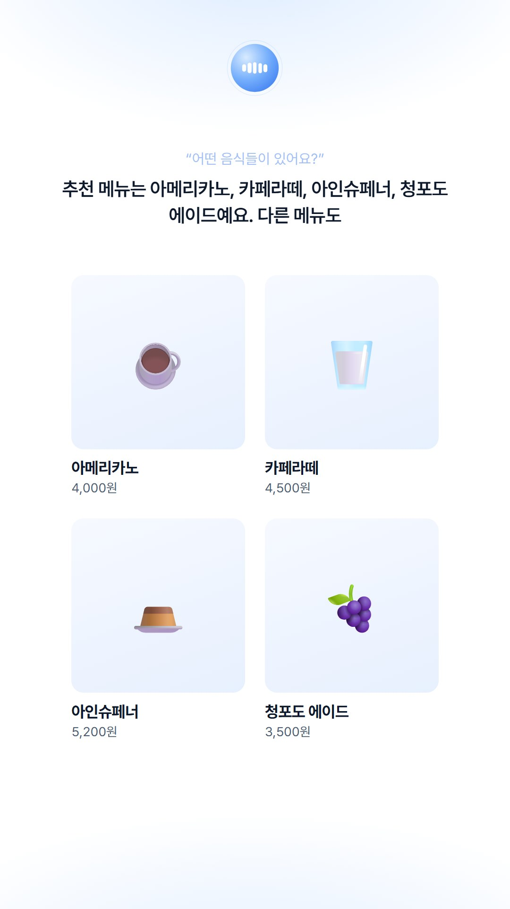
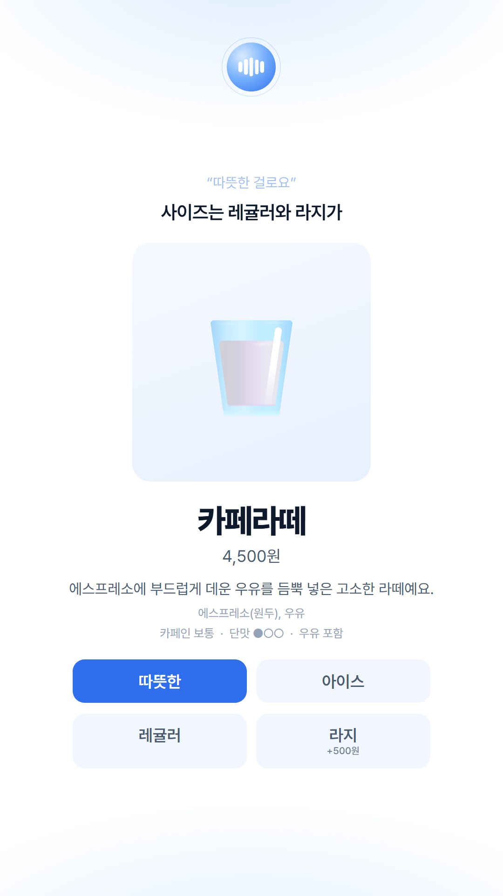
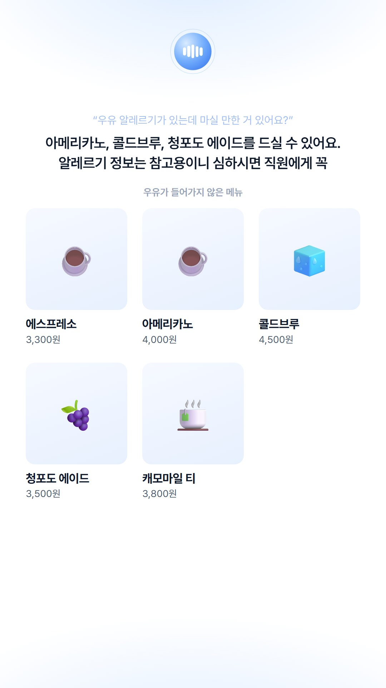
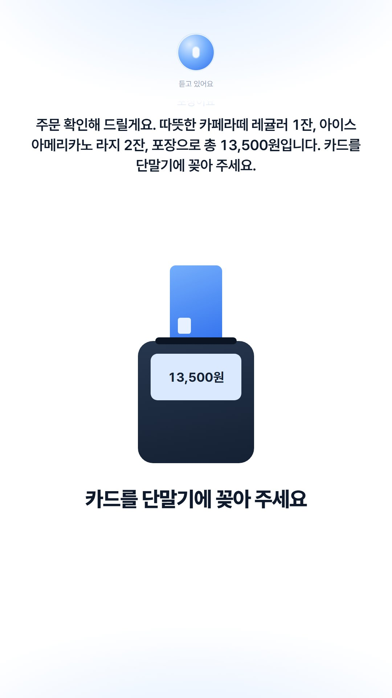
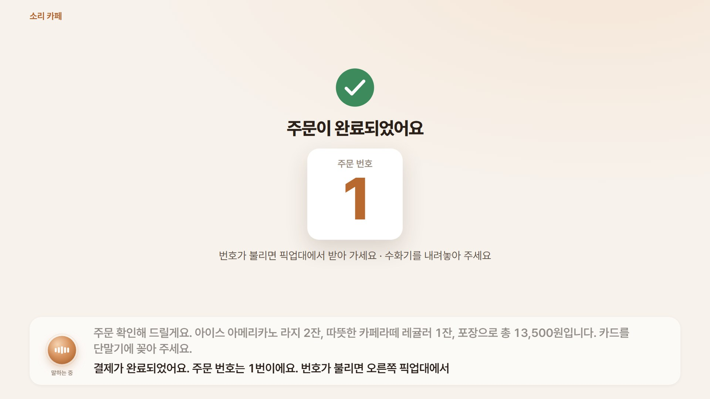

# voice-kiosk

목소리만으로 조작 가능한 카페 키오스크. 수화기를 들면 AI 직원이
인사하고, 주문을 받고, 깔끔하게 움직이는 화면을 보여준다. 터치 기능 없음.

아이디어를 보여 주기 위한 **데모**. 결제는 흉내만.

| | | |
|---|---|---|
|  |  |  |
|  |  |  |

- [키오스크 다운로드](#키오스크-사용법)
- [For developers](#for-developers)

## 키오스크 사용법

필요한 것:

- 인터넷이 되는 **Windows 10 또는 11** 컴퓨터.
- Gemini API key
- 말할 도구: 헤드셋, 마이크 달린 이어폰, 또는 컴퓨터 마이크와 이어폰. 노트북 스피커로도 가능 하지만
 AI가 자신의 목소리를 들을 수 있음.
### 1. 다운로드

1. [최신 릴리스 페이지](https://github.com/jhj1012/voice-kiosk/releases/latest)를 연다.
2. **Assets** 아래의 **`voice-kiosk.zip`** 을 누른다.
3. 다운로드 된 `voice-kiosk.zip` 우클릭, 속성, 차단해제 체크.
4. 압축 풀기.
5. voice-kiosk`** 폴더 안 `Start Kiosk.bat` 또는 `Start Kiosk (full screen).bat` 실행.
6. 1~2분 정도 설치 시간이 있을 수 있음. 기다리기.


### 2. API 키 넣기 (처음 한 번만)

키오스크가 **Gemini API 키**를 물어보면 입력.

### 2-1. API 키 만들기

1. 키오스크 화면의 **Google AI Studio 열기**를 누르고 Google 계정으로 로그인.
2. **Create API key**(API 키 만들기)를 누른다. 프로젝트를 고르라고 하면 추천된 것을 고른다.
3. 새 키 옆의 **복사** 버튼.
4. 키오스크 화면으로 돌아와 입력 칸을 누르고 **Ctrl+V**로 붙여 넣은 뒤 **저장**.
5. **저장했어요**가 나오면 끝. 키는 `voice-kiosk` 폴더 안의 `.env` 파일에 저장되고,
   다음부터는 묻지 않음.

키는 절대 다른 사람에게 공유하지 말것.
### 3. 말해 보기

| 하고 싶은 것 | 방법 |
|---|---|
| 대화 시작 | 키오스크 화면을 한 번 클릭하고 **스페이스바** |
| 주문하기 | 그냥 말하면 됨. 예: "메뉴 뭐 있어요?", "아이스 아메리카노 라지로 한 잔 주세요", "결제할게요". AI가 말하는 중에 끼어들기 가능. |
| 대화 종료 | **스페이스바** |
| 말 대신 글로 입력하기 | **F2**를 누르고 칸에 입력한 뒤 **Enter**. **F2**를 다시 누르면 닫힘. |
| API 키 바꾸기 | **F2**를 누르고 **API 키 바꾸기**. |

결제는 흉내만. AI가 주문 내용을 읽어 주면 카드 단말기가 나오고, 몇 초 뒤에 주문 번호가
나옴.

### 4. 끄기

Alt + f4, 검은 명령어 입력 창 닫기.
### 마이크와 스피커

키오스크는 Windows의 **기본** 마이크와 스피커를 사용. 헤드셋이나 수화기를 쓰려면 먼저 꽂고,
**설정 → 시스템 → 소리**에서 **출력**과 **입력**을 그 장치로 고르기. 그다음 재실행.
### 새 버전 받기

새 `voice-kiosk.zip`을 받아서 **새** 폴더에 압축을 풀기 (1~2단계).
### 문제가 생겼을 때

| 이런 게 보이면 | 이렇게 해 보세요 |
|---|---|
| 검은 창이 잠깐 나왔다가 사라지거나 "uv를 설치하지 못했어요"| 인터넷 연결을 확인. |
| "화면 파일(frontend\dist)이 없어요" | 다른 압축 파일을 받은 것일 수 있음. 릴리스 페이지의 `voice-kiosk.zip` 다운로드. |
| 키 입력 화면에 "Google에 연결할 수 없어요" | 인터넷 연결을 확인하고 **저장**을 다시 누르기. |
| "Google이 이 키를 받아 주지 않았어요" | 키 전체를 다시 복사하거나, 새 키 만들기. |
| 대화 시작시 "지금은 연결할 수 없어요"가 나옴 | 인터넷 문제이거나 gemini가 overload 됨. 잠시 뒤에 다시 시도. 무료 요금제이면 하루 사용량 제한 때문일 수도 있음. |
| AI가 내 말을 못 들음 | Windows에서 맞는 마이크를 고르고 (위 참고) 재실행. |
| AI가 말하다가 혼자 멈춤 | 스피커 소리를 AI가 듣는 것. 이어폰이나 헤드셋 사용 권장. |
| 스페이스바를 눌러도 아무 일도 없음 | 키오스크 창 안을 먼저 한 번 클릭하세요. |

그래도 안 되면 `voice-kiosk` 폴더 안 `logs` 폴더에서 가장 최근 파일을 개발팀에 보내 주세요.
## For developers

- Conversation: the [Gemini Live API](https://ai.google.dev/gemini-api/docs/live) (one streaming
  session per customer: audio in, audio out, interruptions, transcripts, function calls).
- Backend: Python 3.12 (`uv`), FastAPI. It owns the order, validates every action of the model
  and enforces the safety rules (payment, discarding the order) in code.
- Display: Svelte + TypeScript, full-screen in Edge kiosk mode. It only renders what the backend
  pushes over a WebSocket.

Built in eight milestones, all done (see [docs/architecture.md](docs/architecture.md#milestones)
and the [Live API check](docs/live-check.md)).

### Quick start

Needs [uv](https://docs.astral.sh/uv/), [Node.js](https://nodejs.org/) 24 and git; details in
[docs/setup.md](docs/setup.md).

```bash
git clone https://github.com/jhj1012/voice-kiosk.git
cd voice-kiosk
uv sync
npm --prefix frontend ci
npm --prefix frontend run build
uv run python -m kiosk --open   # or double-click Start Kiosk.bat
```

The API key goes in `.env` (`GEMINI_API_KEY=...`, see `.env.example`) or into the form the
display shows. Audio devices: `configs/settings.local.yaml`, see
[docs/setup.md](docs/setup.md#the-handsets-audio).

### Before a demo

A whole order, spoken by the Windows Korean voice into the kiosk, through the real Live API;
PASS/FAIL per step, reply times and screenshots (in `recordings/voice_demo/`):

```bash
uv run python scripts/voice_demo.py            # --listen: hear the assistant on the speakers
```

### Publishing a release

Pushing a tag builds the display and publishes `voice-kiosk.zip` on the Releases page
(`.github/workflows/release.yml`):

```bash
git tag v0.1.1
git push origin v0.1.1
```

### Repository layout

| Path | What |
|---|---|
| `kiosk/domain/` | Menu, order and kiosk flow. Pure Python, fully tested. |
| `kiosk/assistant/` | The Live session, instructions, function declarations, safety rules. |
| `kiosk/voice/` | Audio devices (handset mic and earpiece) and the hook switch. |
| `kiosk/server/` | Wiring, the WebSocket server for the display and the API key form. |
| `frontend/` | The display (Svelte). |
| `data/` | `menu.yaml`, `cafe.yaml` and `images/<item_id>.png`: edit these to change the menu. |
| `configs/` | `settings.yaml`; personal overrides go in git-ignored `settings.local.yaml`. |
| `scripts/` | `start.ps1` (behind `Start Kiosk.bat`), `voice_demo.py`, `live_check.py`, `make_demo_events.py`. |
| `docs/` | [Architecture](docs/architecture.md), [decisions](docs/decisions.md), [setup](docs/setup.md), [Live API check](docs/live-check.md). |

### Checks

```bash
uv run ruff check . && uv run ruff format --check .
uv run lint-imports
uv run pytest
npm --prefix frontend run lint
npm --prefix frontend run check
npm --prefix frontend test
npm --prefix frontend run build
```

### Contributing

Branch → pull request → review. See [CONTRIBUTING.md](CONTRIBUTING.md).
This repository is **public**: never commit API keys, `.env`, `*.local.yaml`, recordings or logs.
