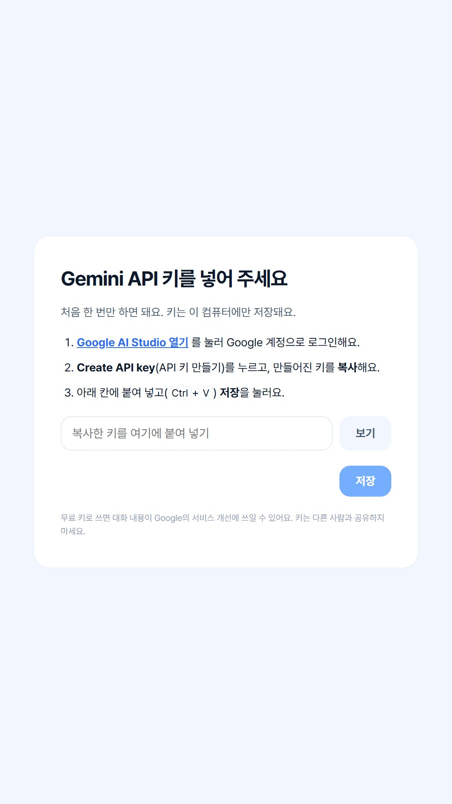

# voice-kiosk

손님이 **목소리만으로** 주문하는 카페 키오스크예요. 전화기 같은 수화기를 들면 AI 직원이 한국어로
인사하고, 주문을 받고, 깔끔하게 움직이는 화면을 보여 줘요. 터치 버튼은 없어요.

아이디어를 보여 주기 위한 **데모**이고, 실제 제품이 아니에요. 결제도 흉내만 내요.

| | | |
|---|---|---|
|  |  |  |
|  |  |  |

- [키오스크 써 보기](#키오스크-써-보기) (프로그래밍을 몰라도 돼요)
- [개발자용](#개발자용)

## 키오스크 써 보기

필요한 것:

- 인터넷이 되는 **Windows 10 또는 11** 컴퓨터. Microsoft Edge는 이미 깔려 있어요.
- **Google 계정**. 무료 Gemini API 키를 만들 때 써요 (아래에서 방법을 알려 드려요).
- 말할 도구: 헤드셋, 마이크 달린 이어폰, 또는 컴퓨터 마이크와 이어폰. 노트북 스피커로도 되지만
  AI가 자기 목소리를 들을 수 있어요 ([문제가 생겼을 때](#문제가-생겼을-때) 참고).

### 1. 다운로드

1. [최신 릴리스 페이지](https://github.com/jhj1012/voice-kiosk/releases/latest)를 열어요.
2. **Assets** 아래의 **`voice-kiosk.zip`** 을 눌러요. Edge가 **다운로드** 폴더에 저장해요.
   파일을 유지할지 물어보면 **유지**를 눌러요.

첫 화면의 초록색 **Code → Download ZIP** 버튼은 쓰지 마세요. 그 압축 파일에는 화면 파일이 들어
있지 않아요.

### 2. 차단 해제하고 압축 풀기

Windows는 인터넷에서 받은 파일을 조심스럽게 다뤄요. 압축 파일의 차단을 먼저 풀어 두면 나중에
경고가 덜 나와요.

1. **다운로드** 폴더를 열고 `voice-kiosk.zip`을 **마우스 오른쪽 버튼**으로 눌러 **속성**을 골라요.
2. **일반** 탭 맨 아래의 **차단 해제**에 체크하고 **확인**을 눌러요. 이 칸이 없으면 넘어가요.
3. `voice-kiosk.zip`을 다시 오른쪽 버튼으로 눌러 **압축 풀기…** 를 골라요. 나중에 다시 찾을
   수 있는 폴더(예: **문서**)를 고르고 **압축 풀기**를 눌러요.
4. 새로 생긴 **`voice-kiosk`** 폴더를 열어요. 안에 `Start Kiosk.bat`이 보이면 돼요.

### 3. 키오스크 켜기

1. **`Start Kiosk.bat`을 더블클릭**해요. 실행할지 물어보면 **실행**을 눌러요. 파란색
   "Windows의 PC 보호" 창이 나오면 **추가 정보**를 누르고 **실행**을 눌러요.
2. **검은 창**이 열려요. 처음에는 키오스크에 필요한 것을 설치하느라 1~2분 걸려요. 검은 창은 열어
   두세요. **검은 창을 닫으면 키오스크가 꺼져요.**
3. 준비가 되면 키오스크 화면이 새 창으로 열려요.

### 4. API 키 넣기 (처음 한 번만)

키오스크가 **Gemini API 키**를 물어봐요. 이 키로 키오스크가 내 계정을 써서 Google의 AI와
이야기해요.



1. 키오스크 화면의 **Google AI Studio 열기**를 누르고 Google 계정으로 로그인해요.
2. **Create API key**(API 키 만들기)를 눌러요. 프로젝트를 고르라고 하면 추천된 것을 골라요.
3. 새 키 옆의 **복사** 버튼을 눌러요.
4. 키오스크 화면으로 돌아와 입력 칸을 누르고 **Ctrl+V**로 붙여 넣은 뒤 **저장**을 눌러요.
5. **저장했어요**가 나오면 끝이에요. 키는 `voice-kiosk` 폴더 안의 `.env` 파일에 저장되고,
   다음부터는 묻지 않아요.

키는 다른 사람에게 알려 주지 마세요. 키가 있으면 누구나 내 Gemini 계정을 쓸 수 있어요. 무료
요금제에서는 Google이 대화 내용을 서비스 개선에 쓸 수 있으니, 키오스크에 개인적인 이야기는 하지
마세요.

### 5. 말해 보기

| 하고 싶은 것 | 방법 |
|---|---|
| 수화기 들기 | 키오스크 화면을 한 번 클릭하고 **스페이스바**를 눌러요 |
| 주문하기 | 그냥 말하면 돼요. 예: "메뉴 뭐 있어요?", "아이스 아메리카노 라지로 한 잔 주세요", "결제할게요". AI가 말하는 중에 끼어들어도 돼요. |
| 수화기 내려놓기 | **스페이스바**를 다시 눌러요 (주문도 지워져요) |
| 말 대신 글로 입력하기 | **F2**를 누르고 칸에 입력한 뒤 **Enter**를 눌러요. **F2**를 다시 누르면 닫혀요. |
| API 키 바꾸기 | **F2**를 누르고 **API 키 바꾸기**를 눌러요 |

결제는 흉내만 내요. AI가 주문 내용을 읽어 주면 카드 단말기가 나오고, 몇 초 뒤에 주문 번호가
나와요.

### 6. 끄기

키오스크 창을 닫고, **검은 창**도 닫아요.

**전체 화면** (실제 키오스크 화면용): `Start Kiosk.bat` 대신
**`Start Kiosk (full screen).bat`** 을 더블클릭해요. 전체 화면에서 나오려면 **Alt+F4**를 누르고,
검은 창을 닫아요.

### 마이크와 스피커

키오스크는 Windows의 **기본** 마이크와 스피커를 써요. 헤드셋이나 수화기를 쓰려면 먼저 꽂고,
**설정 → 시스템 → 소리**에서 **출력**과 **입력**을 그 장치로 골라요. 그다음 키오스크를 다시
켜요 (검은 창을 닫고 `Start Kiosk.bat`을 다시 더블클릭).

### 새 버전 받기

새 `voice-kiosk.zip`을 받아서 **새** 폴더에 압축을 풀어요 (1~2단계). API 키를 그대로 쓰려면 예전
`voice-kiosk` 폴더의 **`.env`** 파일을 새 폴더로 복사하거나, 키를 다시 넣으면 돼요.

### 문제가 생겼을 때

| 이런 게 보이면 | 이렇게 해 보세요 |
|---|---|
| 검은 창이 잠깐 나왔다가 사라지거나 "uv를 설치하지 못했어요"가 나와요 | 인터넷 연결을 확인하고 다시 켜 보세요. 압축 파일의 차단을 풀었나요? (2단계) |
| "화면 파일(frontend\dist)이 없어요"가 나와요 | 다른 압축 파일을 받은 거예요. 릴리스 페이지의 `voice-kiosk.zip`을 받아 주세요 (1단계). |
| 키 입력 화면에 "Google에 연결할 수 없어요"가 나와요 | 인터넷 연결을 확인하고 **저장**을 다시 눌러요. |
| "Google이 이 키를 받아 주지 않았어요"가 나와요 | 키 전체를 다시 복사하거나, 새 키를 만들어요. |
| 수화기를 들면 "지금은 연결할 수 없어요"가 나와요 | 인터넷 문제이거나 Google이 바쁜 거예요. 잠시 뒤에 다시 해 보세요. 무료 요금제에는 하루 사용량 제한도 있어요. |
| AI가 내 말을 못 들어요 | Windows에서 맞는 마이크를 고르고 (위 참고) 키오스크를 다시 켜요. |
| AI가 말하다가 혼자 멈춰요 | 스피커 소리를 AI가 듣는 거예요. 이어폰이나 헤드셋을 써 주세요. |
| 스페이스바를 눌러도 아무 일도 없어요 | 키오스크 창 안을 먼저 한 번 클릭해요. |

그래도 안 되면 `voice-kiosk` 폴더 안 `logs` 폴더에서 가장 최근 파일을 팀에 보내 주세요. 대화가
글로만 들어 있어요 (녹음과 API 키는 없어요).

## 개발자용

- 대화: [Gemini Live API](https://ai.google.dev/gemini-api/docs/live). 손님마다 스트리밍 세션
  하나로 음성 입력과 출력, 끼어들기, 대화 글자, 함수 호출을 처리해요.
- 백엔드: Python 3.12 (`uv`), FastAPI. 주문을 관리하고, 모델이 하는 모든 동작을 검사하고, 안전
  규칙(결제, 주문 지우기)을 코드로 지켜요.
- 화면: Svelte + TypeScript, Edge 키오스크 모드 전체 화면. 백엔드가 WebSocket으로 보내 주는 것만
  그려요.

여덟 개의 마일스톤으로 만들었고 모두 끝났어요 ([docs/architecture.md](docs/architecture.md#milestones),
[Live API 점검 결과](docs/live-check.md)). 자세한 문서(`docs/`)와 코드 주석은 영어로 되어 있어요.

### 빠른 시작

[uv](https://docs.astral.sh/uv/), [Node.js](https://nodejs.org/) 24, git이 필요해요. 자세한
내용은 [docs/setup.md](docs/setup.md)에 있어요.

```bash
git clone https://github.com/jhj1012/voice-kiosk.git
cd voice-kiosk
uv sync
npm --prefix frontend ci
npm --prefix frontend run build
uv run python -m kiosk --open   # 또는 Start Kiosk.bat 더블클릭
```

API 키는 `.env`에 넣거나(`GEMINI_API_KEY=...`, `.env.example` 참고) 화면의 입력 창에 넣어요.
오디오 장치는 `configs/settings.local.yaml`에서 골라요
([docs/setup.md](docs/setup.md#the-handsets-audio)).

### 데모 전에 점검하기

Windows 한국어 음성이 실제 Live API를 거쳐 키오스크에 주문 하나를 처음부터 끝까지 말해요.
단계마다 통과/실패, 응답 시간, 스크린샷(`recordings/voice_demo/`)이 나와요.

```bash
uv run python scripts/voice_demo.py            # --listen: AI 목소리를 스피커로 듣기
```

### 릴리스 올리기

태그를 올리면 화면 파일을 빌드해서 릴리스 페이지에 `voice-kiosk.zip`을 올려요
(`.github/workflows/release.yml`).

```bash
git tag v0.1.1
git push origin v0.1.1
```

### 폴더 구조

| 경로 | 내용 |
|---|---|
| `kiosk/domain/` | 메뉴, 주문, 키오스크 흐름. 순수 Python이고 테스트가 다 있어요. |
| `kiosk/assistant/` | Live 세션, AI 지시문, 함수 선언, 안전 규칙. |
| `kiosk/voice/` | 오디오 장치(수화기 마이크와 스피커)와 수화기 걸이 스위치. |
| `kiosk/server/` | 연결 부분, 화면용 WebSocket 서버, API 키 입력 처리. |
| `frontend/` | 화면 (Svelte). |
| `data/` | `menu.yaml`, `cafe.yaml`, `images/<item_id>.png`. 메뉴를 바꾸려면 이 파일들을 고쳐요. |
| `configs/` | `settings.yaml`. 내 컴퓨터만의 설정은 git에 올라가지 않는 `settings.local.yaml`에 넣어요. |
| `scripts/` | `start.ps1` (`Start Kiosk.bat`이 실행), `voice_demo.py`, `live_check.py`, `make_demo_events.py`. |
| `docs/` | [구조](docs/architecture.md), [결정 기록](docs/decisions.md), [설치](docs/setup.md), [Live API 점검](docs/live-check.md). |

### 검사

```bash
uv run ruff check . && uv run ruff format --check .
uv run lint-imports
uv run pytest
npm --prefix frontend run lint
npm --prefix frontend run check
npm --prefix frontend test
npm --prefix frontend run build
```

### 기여하기

브랜치 → 풀 리퀘스트 → 리뷰 순서로 해요. [CONTRIBUTING.md](CONTRIBUTING.md)를 봐 주세요.
이 저장소는 **공개**되어 있어요. API 키, `.env`, `*.local.yaml`, 녹음, 로그는 절대 올리지 마세요.
